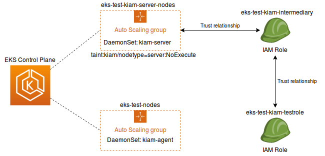

# Sample deployment of kiam on AWS EKS
This is a sample technical demo deployment of kiam on Amazon EKS with minimal dependencies.

## Dependencies

- [terraform](www.terraform.io) 0.11.x for creating the resources on AWS
- [aws cli](https://docs.aws.amazon.com/cli/latest/userguide/cli-chap-install.html) 1.16.156 or greater
- [kubectl](https://kubernetes.io/docs/tasks/tools/install-kubectl/)
- [cfssl](https://github.com/cloudflare/cfssl), see [TLS.md](https://github.com/uswitch/kiam/blob/master/docs/TLS.md#manually)
- basic linux tools

## Details

This terraform code creates the following setup. Various technicalities (SecurityGroups etc) between nodes and control plane omitted in the graph.

On EKS, we have no access to the control plane, so we create a designated set of nodes for the kiam server to run on (eks-test-kiam-server-nodes). This set of nodes is launched with a taint that prevents other workloads from being scheduled on them. The kiam server is deployed as a DaemonSet that targets only the kiam-server nodes. The kiam agent is then deployed as a normal DaemonSet on the regular node set (eks-test-nodes).

We create a intermediary role (eks-test-kiam-intermediary) with a trust relationship to the InstanceProfile of the kiam-server nodes ONLY. This means regular nodes (and pods on them) in eks-test-nodes cannot assume that role.
kiam-server will assume that role and all pod-assumed roles have to trust this role to be assumed by kiam.

## Spinning up the cluster

First, fill in `test.tvars` You can use `make tf-plan` to test your terraform deployment. The makefile will reject code that does not conform to `terraform fmt`.

If your tf-plan looks good, use `make fulldeploy` to deploy the cluster and install kiam on it. You can run a very simple test to check if kiam is working with `make test-kiam`. Use `make tf-destroy` to destroy everything.

Alternatively, you can use `make test` to do all of the steps above in succession.
